# Experiment 4.7.2 — PR Refinement History and Conway Drift

## Purpose

- Goal: recover longitudinal PR refinement trajectories and test whether review rounds systematically reduce Conway-style patch risk.
- Unit of analysis: cumulative patch snapshots `base_sha..commit_i` over the visible commit history of merged PRs in `prs_copy`.
- Signals: Conway patch features, ownership/blame features, review-thread alignment, and commit-to-commit post-review deltas.

## Current Production Run

- Current production run tag: `phase4_7_2_slurm_ramcache_v1`
- Live infrastructure snapshot as of `2026-03-12 17:58 UTC`:
  - `4,144` PR checkpoints stored in Postgres
  - `4,079` currently marked `ok`
  - latest checkpoint write at `2026-03-12 17:58:59 UTC`
- Current Slurm shape:
  - partition: `debug`
  - nodes: `22`
  - tasks: `22`
  - `192` CPUs per task
  - mixed hardware: `lux-3-bm-cpu-[01-10]` and `lux-3-cyber-[01-12]`
- Important cluster constraint:
  - the `debug` partition has `22` idle nodes, but only the `cyber` nodes expose `224` CPUs
  - full 22-node runs therefore need `CPUS_PER_TASK=192`, not `224`

## Infrastructure

```mermaid
flowchart LR
    A[Postgres<br/>prs_copy] --> B[prepare_pr_refinement_history_shards.py<br/>instance_id shard lists]
    R[/shared_workspace_mfs/repos<br/>MooseFS full repo mirror/] --> C
    B --> C

    subgraph C[Slurm debug partition]
        direction LR
        D[1 shard worker per node<br/>192 CPUs per task] --> E[/dev/shm repo cache<br/>copy repo once per worker/]
        E --> F[fuse-overlayfs<br/>overlay only if SHA recovery is needed]
        F --> G[git diff / show / blame<br/>sample up to 5 commit snapshots per PR]
        G --> H[extract_conway_patch_features.py]
        H --> I[extract_pr_refinement_history.py]
    end

    I --> J[Postgres<br/>pr_refinement_history_checkpoints]
    I --> K[shard JSONL<br/>progress log<br/>partial summary]
    K --> L[summarize_pr_refinement_history.py]
    L --> M[docs/phase4_7_2_pr_refinement_history.md]
```

## Execution Model

- Dataset filter:
  - merged PRs only
  - `total_commits >= 2`
  - `commits` JSON present
  - line/file filters applied at shard preparation time
- Snapshot policy:
  - cumulative snapshots from `base_sha` to sampled commit `i`
  - maximum `5` sampled commits per PR
  - equal-interval sampling over visible commits
- Review alignment:
  - review-thread comments and submitted reviews attached by timestamp to commit intervals
- Storage:
  - shard-local JSONL and progress logs under `data/phase4_7_2_slurm_ramcache_v1/shard_outputs`
  - durable per-PR checkpoint state in Postgres table `pr_refinement_history_checkpoints`

## Validation Milestones

- Branch/SHA recovery worked on targeted smoke runs, establishing that missing refs can often be recovered via PR/head fetch paths.
- Incremental shard progress logging and partial summaries were added so long Slurm runs are observable before completion.
- Tmpfs repo cache plus overlay-on-demand removed most MooseFS metadata pressure from the hot path.
- Postgres checkpointing and resume were added so completed PRs are skipped on restart by `run_tag`.
- `fuse-overlayfs` had to be installed on all participating node types; CPU nodes initially failed overlay mounts until that was fixed.

## Preliminary Analytical Result

The only completed analytical summary so far is still the early `120`-PR sample. The full production run is still in flight.

- PRs analyzed: `41`
- Commit snapshots analyzed: `239`
- Review-response transitions: `25`
- Median heuristic Conway risk proxy, first -> final: `3.339` -> `3.425`
- Median heuristic Conway risk proxy, pre-review -> post-review response: `4.320` -> `4.320`

The risk proxy is a heuristic aggregate over Conway-style patch signals. It is useful as a compact summary, but the per-metric deltas are the more important evidence.

| Metric | First->final median delta | First->final improved | Post-review median delta | Post-review improved |
|---|---:|---:|---:|---:|
| `conway_risk_proxy` | 0.000 | 43.9% | 0.000 | 28.0% |
| `conway_risk_flags` | 0.000 | 26.8% | 0.000 | 20.0% |
| `api_change_without_tests` | 0.000 | 12.2% | 0.000 | 8.0% |
| `public_api_without_docs` | 0.000 | 12.2% | 0.000 | 12.0% |
| `shared_change_isolated` | 0.000 | 2.4% | 0.000 | 0.0% |
| `ownership_diffusion` | 0.000 | 22.0% | 0.000 | 8.0% |
| `boundary_density` | -0.048 | 61.0% | 0.000 | 24.0% |
| `operability_score` | 0.000 | 7.3% | 0.000 | 4.0% |

## Interpretation

- Negative deltas are better for risk metrics; positive deltas are better for quality metrics such as `operability_score`.
- The early sample suggests weak first-order improvement in some structural risk metrics, but not yet a strong post-review correction effect.
- That result should not be over-interpreted until the larger production run finishes, because the 120-PR slice is small and operationally biased by early recovery constraints.
- This analysis only sees the surviving visible PR history from `prs_copy`; force-pushed-away commits are still missing.

## Sampling Note

- The original implementation used every visible commit in a PR, but very long PRs made the run dominated by a small number of commit-heavy or very large repositories.
- The current extractor therefore caps each PR at a small number of cumulative snapshots, sampled at equal intervals across the visible commit sequence. With `max_snapshots=5`, a 9-commit PR is sampled as commit indices `1, 3, 5, 7, 9`.
- This is a lossy approximation: it can miss short-lived oscillations where a risky intermediate revision is introduced and then removed before the next sampled point.
- In practice, the assumption is that most PR evolution is lower-frequency than the raw commit stream. Review-driven refinement usually changes scope, interface shape, tests, or cross-module spread over several commits rather than in a single one-commit spike.
- The Nyquist/Shannon analogy is only partial here. Commits are already discrete author actions rather than a uniformly sampled continuous-time signal, so there is no strict sampling theorem guarantee. The practical question is not alias-free reconstruction of the full trajectory, but whether a sparse set of visible revisions is sufficient to recover the main directional trend of Conway risk.
- For this experiment, the tradeoff is acceptable because the goal is longitudinal trend estimation, not exact replay of every micro-edit. If future analysis suggests meaningful high-frequency review-response patterns, the sampling policy should be revisited or made adaptive around review events.

## Operational Lessons

- Slurm CPU allocation matters more than Python thread count:
  - the initial run asked for `224` workers but only got `1` CPU per task
  - the launcher now requests `--cpus-per-task` explicitly
- Mixed-node partitions need shape-aware scheduling:
  - `22 x 224` CPUs per task was unsatisfiable because only `12` nodes in `debug` have `224` CPUs
  - `22 x 192` works across both `bm-cpu` and `cyber`
- Overlayfs should be used only when SHA recovery is needed:
  - most read-only git analysis can stay on the tmpfs repo copy
- Checkpointing must skip only successful PRs on resume:
  - failed states such as `overlay_mount_failed` need to be retried after an environment fix

## Canonical Artifacts

- Main report: `docs/phase4_7_2_pr_refinement_history.md`
- Live shard outputs: `data/phase4_7_2_slurm_ramcache_v1/shard_outputs`
- Live run directory: `data/phase4_7_2_slurm_ramcache_v1`
- Checkpoints: Postgres table `pr_refinement_history_checkpoints`
- Historical small-sample summary artifacts:
  - `data/phase4_7_2_pr_refinement_history.jsonl`
  - `data/phase4_7_2_pr_refinement_history_summary.json`
